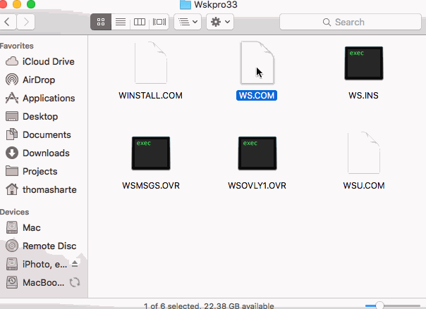
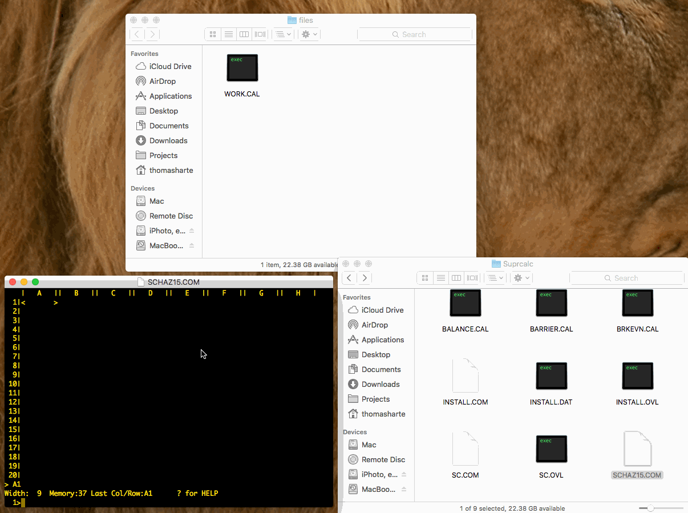
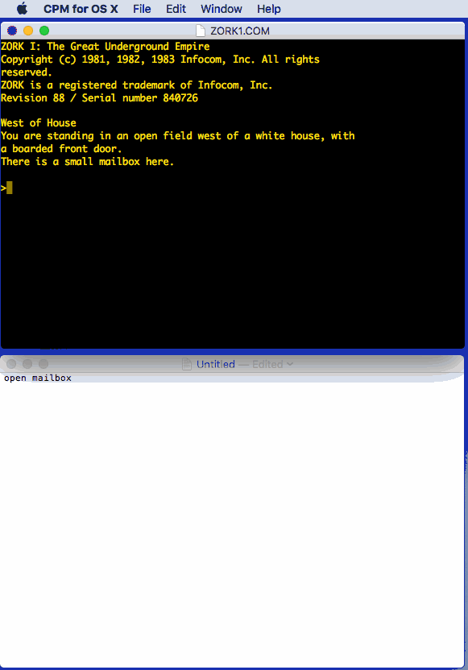
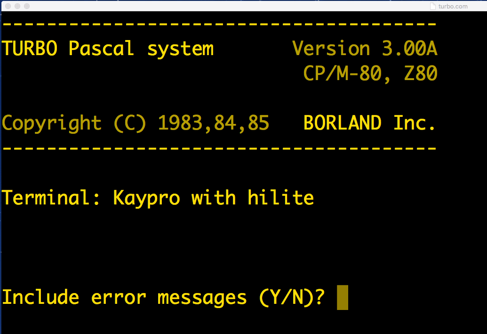
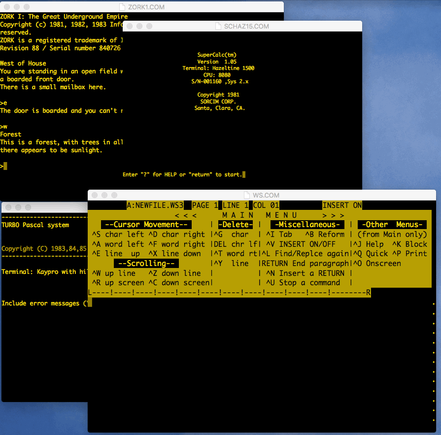

CP/M for OS X
=============
Build command for macOS this will give you CPM for OS X.app the local directory, move it into the applications directory.
- CPM for OS X-Info.plist modified so it will run on macOS Tahoe

% xcodebuild -project "CPM for OS X.xcodeproj" \
           -scheme "CPM for OS X" \
           -configuration Release \
           CONFIGURATION_BUILD_DIR="$(pwd)" \
           clean build
           
It…

* allows you to run CP/M-80 software on your Mac:

* supports drag and drop mounting of drives for opening files:

* supports copy and paste:

* uses native text rendering for a completely flexible window:

* multitasks, naturally:

